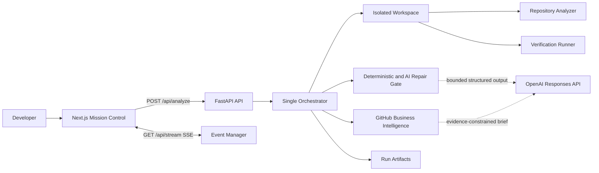

# ForgeOS

ForgeOS is a local-first engineering control room for GitHub repositories. It clones a repository into an isolated workspace, builds a file and dependency map, discovers a repository-owned test command, and streams a fourteen-stage engineering run to a Next.js Mission Control dashboard.

The product is deliberately evidence-first. Repository analysis, test execution, health scoring, GitHub metrics, and git operations are deterministic. OpenAI is used only for bounded tasks that need model judgment: an unresolved, test-backed repair; a regression-test candidate after a verified repair; and an evidence-constrained business brief.

## What ForgeOS Does

- Clones supported GitHub repositories or runs the bundled demo repository.
- Builds a file inventory, framework summary, repository tree, and local import graph.
- Discovers and runs real pytest or repository-owned npm test commands.
- Classifies failures, tries deterministic repairs, and gates model repair on collected evidence.
- Applies patches only inside an isolated workspace, then verifies or rolls them back.
- Streams pipeline, agent, terminal, planner, diff, health, business, decision, reasoning, impact, and OpenAI activity events through SSE.
- Collects GitHub repository metrics and creates a constrained business brief.
- Creates a local commit after verified changes; optional push and pull-request creation are explicitly gated.
- Writes a per-run artifact bundle for review after execution.

## Architecture



The dashboard presents six specialist personas, but the backend remains one sequential orchestration pipeline. This keeps the execution model understandable and makes every state change observable.

## Quick Start

### Prerequisites

- Python 3.12 or later
- Node.js 20 or later
- npm
- Git

### Backend

```bash
cd backend
python3 -m venv .venv
source .venv/bin/activate
python -m pip install fastapi "uvicorn[standard]" pydantic openai httpx gitpython python-dotenv pytest pytest-asyncio
python -m uvicorn app.main:app --reload --port 8000
```

The API is then available at `http://localhost:8000`, with interactive OpenAPI documentation at `http://localhost:8000/docs`.

### Frontend

```bash
cd frontend
npm ci
npm run dev
```

Open `http://localhost:3000`. The frontend defaults to `http://localhost:8000`; set `NEXT_PUBLIC_API_URL` in `frontend/.env.local` only when the backend runs elsewhere.

### Run an Analysis

Use a public GitHub URL such as:

```text
https://github.com/owner/repository
```

For the bundled deterministic demo, use `demo`, `local`, or leave the repository URL blank where the UI permits it.

## Configuration

Create a root `.env` from the values relevant to your run. Keep this file local and never commit it.

```env
OPENAI_API_KEY=...
OPENAI_REPAIR_MODEL=gpt-5.6
OPENAI_BI_MODEL=gpt-5.6-luna
OPENAI_TIMEOUT_SECONDS=15
GITHUB_TOKEN=...
FORGEOS_ALLOW_DEMO_AI_FALLBACK=false
FORGEOS_GIT_AUTHOR_NAME=ForgeOS
FORGEOS_GIT_AUTHOR_EMAIL=forgeos@example.com
FORGEOS_ENABLE_GIT_PUSH=false
```

`OPENAI_API_KEY` enables guarded repair, regression-test, and business-brief operations. `GITHUB_TOKEN` improves GitHub API reliability and is required to create a pull request when push/PR support is enabled.

See [Configuration](docs/configuration.md) for the full behavior of each setting.

## The Engineering Run

ForgeOS runs these stages in order:

1. Clone repository
2. Analyze repository
3. Detect framework and tests
4. Run tests
5. Classify failures
6. Try deterministic fixes
7. Evaluate the AI repair gate
8. Apply approved patch
9. Re-run tests
10. Check mutation coverage eligibility
11. Generate regression coverage when eligible
12. Calculate repository health
13. Publish business intelligence
14. Stream final results and finalize git work

Read [Pipeline and Repair Gates](docs/pipeline.md) for the exact model-call conditions and outcomes.

## Repository Layout

```text
ForgeOs/
├── backend/
│   ├── app/
│   │   ├── analysis/       # File inventory and dependency graph
│   │   ├── api/            # REST and SSE routes
│   │   ├── events/         # Session queues and replay buffers
│   │   ├── models/         # Pydantic request and event schemas
│   │   ├── pipeline/       # Orchestrator, state, decisions
│   │   ├── repository/     # Workspace preparation
│   │   ├── services/       # Repair, GitHub BI, git, artifacts
│   │   └── verification/   # Repository-owned test execution
│   ├── app/workspaces/     # Ephemeral cloned workspaces
│   ├── app/runs/           # Generated run bundles
│   └── tests/
├── frontend/
│   ├── app/                # Next.js route and styles
│   ├── components/         # Mission Control panels
│   ├── hooks/              # SSE and state reducer hooks
│   ├── services/           # API client
│   └── types/              # Shared frontend event types
└── docs/                   # Product and engineering reference
```

## Documentation

- [Architecture](docs/architecture.md)
- [API and SSE Contract](docs/api.md)
- [Pipeline and Repair Gates](docs/pipeline.md)
- [Business Intelligence](docs/business-intelligence.md)
- [Configuration](docs/configuration.md)
- [Development and Validation](docs/development.md)
- [Operations and Run Artifacts](docs/operations.md)
- [Security](docs/security.md)

Historical plans and audits remain in the repository for context. The documentation above describes the current implementation.

## Validation

```bash
cd backend && .venv/bin/python -m pytest tests -q
cd frontend && npx tsc --noEmit && npm run lint && npm run build
```

The current local validation baseline is 30 backend tests, TypeScript checking, ESLint, and a production Next.js build.

## Security Note

ForgeOS executes repository-owned test commands in a local workspace. Treat unfamiliar repositories as untrusted code and use a disposable environment until containerized execution is introduced. See [Security](docs/security.md) before using ForgeOS against private or unknown repositories.

## License

MIT. See [LICENSE](LICENSE).
