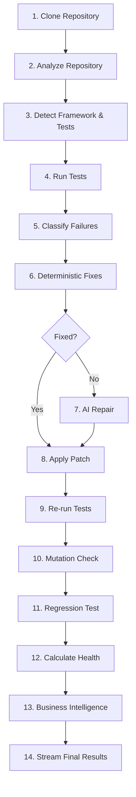

# ForgeOS Backend Architecture

ForgeOS backend is a FastAPI-powered autonomous software engineering pipeline. It orchestrates repository cloning, static analysis, dependency mapping, test runs, deterministic and AI-driven fixing, health calculations, and business intelligence, streaming all process events in real time to the frontend via Server-Sent Events (SSE).

---

## 📂 Backend Project Structure

The backend source code is located in the [backend/app](file:///Users/yashdaga/Desktop/dev/ForgeOs/backend/app) directory, organized as follows:

*   **[app/main.py](file:///Users/yashdaga/Desktop/dev/ForgeOs/backend/app/main.py)**: The FastAPI entry point. It sets up CORS, lifespan events, routes, and logging.
*   **[app/config.py](file:///Users/yashdaga/Desktop/dev/ForgeOs/backend/app/config.py)**: Configuration manager that loads configuration options (e.g., OpenAI keys, models, directories) using Pydantic schemas.
*   **[app/api/](file:///Users/yashdaga/Desktop/dev/ForgeOs/backend/app/api)**
    *   **[routes.py](file:///Users/yashdaga/Desktop/dev/ForgeOs/backend/app/api/routes.py)**: Contains the API routes. Handlers for starting a session (`POST /api/analyze`) and receiving the Event Stream (`GET /api/stream`).
*   **[app/pipeline/](file:///Users/yashdaga/Desktop/dev/ForgeOs/backend/app/pipeline)**
    *   **[orchestrator.py](file:///Users/yashdaga/Desktop/dev/ForgeOs/backend/app/pipeline/orchestrator.py)**: The core engine of ForgeOS. Executes the 14-step workflow, manages session contexts, and publishes agent states.
    *   **[state.py](file:///Users/yashdaga/Desktop/dev/ForgeOs/backend/app/pipeline/state.py)**: Defines the execution context ([PipelineContext](file:///Users/yashdaga/Desktop/dev/ForgeOs/backend/app/pipeline/state.py#L37)) and stages ([PipelineStage](file:///Users/yashdaga/Desktop/dev/ForgeOs/backend/app/pipeline/state.py#L15)).
    *   **[decision_engine.py](file:///Users/yashdaga/Desktop/dev/ForgeOs/backend/app/pipeline/decision_engine.py)**: Dynamically constructs stage-specific `DecisionEvent` reasoning (Reason, Evidence, Expected Outcome, Confidence, Status) for all 14 pipeline stages using context parameters.
*   **[app/events/](file:///Users/yashdaga/Desktop/dev/ForgeOs/backend/app/events)**
    *   **[manager.py](file:///Users/yashdaga/Desktop/dev/ForgeOs/backend/app/events/manager.py)**: Manages subscriptions and buffers SSE event queues for each active session.
*   **[app/models/](file:///Users/yashdaga/Desktop/dev/ForgeOs/backend/app/models)**
    *   **[events.py](file:///Users/yashdaga/Desktop/dev/ForgeOs/backend/app/models/events.py)**: Pydantic models mapping out all the SSE events flowing through the stream. Declares `AgentName` enum mapping to 6 core agents with legacy compatibility aliases.
    *   **[schemas.py](file:///Users/yashdaga/Desktop/dev/ForgeOs/backend/app/models/schemas.py)**: Input/output request schemas for the REST endpoints.
*   **[app/analysis/](file:///Users/yashdaga/Desktop/dev/ForgeOs/backend/app/analysis)**
    *   **[repository_analyzer.py](file:///Users/yashdaga/Desktop/dev/ForgeOs/backend/app/analysis/repository_analyzer.py)**: Codebase layout scanning, file counting, and static language/framework detection.
    *   **[dependency_graph.py](file:///Users/yashdaga/Desktop/dev/ForgeOs/backend/app/analysis/dependency_graph.py)**: Builds a file-level import graph from Python AST and JS/TS local imports, and calculates the change blast radius.
*   **[app/repository/](file:///Users/yashdaga/Desktop/dev/ForgeOs/backend/app/repository)**
    *   **[workspace.py](file:///Users/yashdaga/Desktop/dev/ForgeOs/backend/app/repository/workspace.py)**: Directory allocation and file operations for active cloned project sandboxes.
*   **[app/verification/](file:///Users/yashdaga/Desktop/dev/ForgeOs/backend/app/verification)**
    *   **[pytest_runner.py](file:///Users/yashdaga/Desktop/dev/ForgeOs/backend/app/verification/pytest_runner.py)**: Test runner executing tests in a subprocess and capturing output.
*   **[app/services/](file:///Users/yashdaga/Desktop/dev/ForgeOs/backend/app/services)**
    *   **[git_integration.py](file:///Users/yashdaga/Desktop/dev/ForgeOs/backend/app/services/git_integration.py)**: Clones repositories and manages commits, logs, and diff files.
    *   **[repair_engine.py](file:///Users/yashdaga/Desktop/dev/ForgeOs/backend/app/services/repair_engine.py)**: Applies heuristic-based or simple deterministic fixes.
    *   **[ai_repair.py](file:///Users/yashdaga/Desktop/dev/ForgeOs/backend/app/services/ai_repair.py)**: Connects to OpenAI API using Structured Outputs to obtain patches.
    *   **[ai_insights.py](file:///Users/yashdaga/Desktop/dev/ForgeOs/backend/app/services/ai_insights.py)**: Connects to OpenAI API using structured schemas to produce evidence-backed business briefs.
    *   **[patch_manager.py](file:///Users/yashdaga/Desktop/dev/ForgeOs/backend/app/services/patch_manager.py)**: Backs up original file contents dynamically in memory during transaction cycles.
    *   **[rollback_manager.py](file:///Users/yashdaga/Desktop/dev/ForgeOs/backend/app/services/rollback_manager.py)**: Reverts codebase files to backup states or runs git cleanses if verification checks fail.
    *   **[artifact_manager.py](file:///Users/yashdaga/Desktop/dev/ForgeOs/backend/app/services/artifact_manager.py)**: Generates and bundles markdown summary reports, diff patches, and detailed JSON telemetry files in the runs directory at the end of execution.
    *   **[business_intelligence.py](file:///Users/yashdaga/Desktop/dev/ForgeOs/backend/app/services/business_intelligence.py)**: Gathers metadata from GitHub API and dependency registries.

---

## ⚙️ The 14-Step Orchestration Pipeline

The main execution flow in the backend occurs sequentially. While the frontend presents specialist agents to coordinate separate areas, the backend uses a single, unified pipeline managed in [orchestrator.py](file:///Users/yashdaga/Desktop/dev/ForgeOs/backend/app/pipeline/orchestrator.py).

### Details of the Pipeline Stages
1.  **Clone Repository (`_stage_clone`)**: Clones the Git URL using GitPython. Publishes an `Atlas` (`AgentName.SUPERVISOR`) agent update.
2.  **Analyze Repository (`_stage_analyze`)**: Scans filesystem layout. Publishes `Oracle` (`AgentName.REPOSITORY_ANALYST`) agent updates.
3.  **Detect Framework & Tests (`_stage_detect_framework`)**: Identifies languages, web frameworks, and test frameworks. Publishes `Oracle` (`AgentName.REPOSITORY_ANALYST`) agent updates.
4.  **Run Tests (`_stage_run_tests`)**: Executes tests via [PytestRunner](file:///Users/yashdaga/Desktop/dev/ForgeOs/backend/app/verification/pytest_runner.py). Publishes `Pulse` (`AgentName.QA`) agent updates.
5.  **Classify Failures (`_stage_classify_failures`)**: Groups errors to direct repairs. Publishes `Oracle` (`AgentName.PLANNER`) updates.
6.  **Deterministic Fixes (`_stage_deterministic_fix`)**: Applies templated corrections for known simple bugs. Publishes `Forge` (`AgentName.REPAIR`) agent updates.
7.  **AI Repair (`_stage_ai_repair`)**: Streams a 7-step AI reasoning flow (`Reading traceback...` ➔ `Comparing stack traces...` ➔ `Root cause identified.` ➔ `Searching affected module...` ➔ `Generating patch...` ➔ `Verifying assumptions...` ➔ `Patch approved.`) to the subscriber stream. Uses OpenAI Structured Outputs for diff generation. Publishes `Forge` (`AgentName.REPAIR`) agent updates.
8.  **Apply Patch (`_stage_apply_patch`)**: Integrates diff patch to workspace files. Publishes `Forge` (`AgentName.FORGE`) updates.
9.  **Re-run Tests (`_stage_rerun_tests`)**: Re-runs tests to verify patch correctness. Publishes `Pulse` (`AgentName.PULSE`) updates.
10. **Mutation Check (`_stage_mutation_check`)**: Injects mutators to ensure test assertions capture anomalies. Publishes `Pulse` (`AgentName.QA`) updates.
11. **Regression Test (`_stage_regression_test`)**: Automatically generates a regression test file. Publishes `Pulse` (`AgentName.QA`) updates.
12. **Calculate Health (`_stage_calculate_health`)**: Computes scores (A-, quality, risk parameters). Publishes `Sentinel` (`AgentName.SECURITY`) and `Nitro` (`AgentName.PERFORMANCE`) agent updates.
13. **Business Intelligence (`_stage_business_intelligence`)**: Queries community stats. Publishes `Oracle` (`AgentName.BUSINESS`) updates.
14. **Stream Results (`_stage_stream_results`)**: Publishes a summary completion payload and sets the session state to completed. Publishes `Atlas` (`AgentName.SUPERVISOR`) updates.

---

## 📡 SSE Event Streaming & Managers

Instead of static polling, the backend publishes events in real-time.

*   **API Streaming Route**: Connects at `GET /api/stream?session_id=<session_id>`. If no session ID is supplied, the endpoint defaults to the most recently created session.
*   **EventManager**: Located in [manager.py](file:///Users/yashdaga/Desktop/dev/ForgeOs/backend/app/events/manager.py). It acts as a pub/sub manager:
    *   `create_session(session_id)`: Initializes a session queue.
    *   `publish(session_id, event)`: Pushes events to all registered clients for that session.
    *   `subscribe(session_id)`: Yields SSE format strings (`data: {...}\n\n`) to the FastAPI StreamingResponse. It maintains an event buffer of 200 items, meaning if a user joins or reloads, they receive past events instantly.
    *   `close_session(session_id)`: Closes active subscriber sockets.

### SSE Event Schema

The data sent over SSE conforms to a strict set of Pydantic schemas in [models/events.py](file:///Users/yashdaga/Desktop/dev/ForgeOs/backend/app/models/events.py). The key event models are:
*   `PipelineUpdateEvent` (event: `"pipeline_update"`): Updates stage indices and overall run progress.
*   `AgentUpdateEvent` (event: `"agent_update"`): Updates agent panel stats, speech logs, progress, and confidences.
*   `TerminalLogEvent` (event: `"terminal_log"`): Streams log lines from tests or internal subprocesses directly into the terminal window.
*   `RepositoryUpdateEvent` (event: `"repository_update"`): Dispatches file paths, lines, and detected languages.
*   `ArchitectureUpdateEvent` (event: `"architecture_update"`): Dispatches component dependency maps.
*   `DiffUpdateEvent` (event: `"diff_update"`): Sends unified code diff patches for the Diff Panel.
*   `HealthUpdateEvent` (event: `"health_update"`): Sends health scores across the 7 dimensions, grade, and summary metrics.
*   `BusinessUpdateEvent` (event: `"business_update"`): Supplies GitHub stars, release statistics, and competitor comparisons.
*   `DecisionEvent` (event: `"decision_event"`): Streams reasoning events explaining each stage's logic in real-time.
*   `ReasoningUpdateEvent` (event: `"reasoning_update"`): Streams concise evidence-backed rationale with a stable step ID and lifecycle status. This is separate from pipeline stage history and structured decision records.

---

## 🔑 Environment Configuration

Backend options are stored inside the [Settings](file:///Users/yashdaga/Desktop/dev/ForgeOs/backend/app/config.py#L27) class. It looks for environment variables from `.env`, `.env.local`, or the shell:

| Environment Variable | Description | Default |
| :--- | :--- | :--- |
| `OPENAI_API_KEY` | Key used for the OpenAI AI repair calls. | `None` (triggers demo simulations if missing) |
| `OPENAI_REPAIR_MODEL` | OpenAI model utilized for AI repairs. | `gpt-5.6` |
| `GITHUB_TOKEN` | Auth token to prevent GitHub API rate limiting. | `None` |
| `FORGEOS_ENABLE_GIT_PUSH` | Enables the explicit commit, push, and GitHub pull request finalizer. | `false` |
| `FORGEOS_ALLOW_DEMO_AI_FALLBACK` | If `true`, explicitly allows the bundled demo fallback when OpenAI is unavailable. | `false` |
