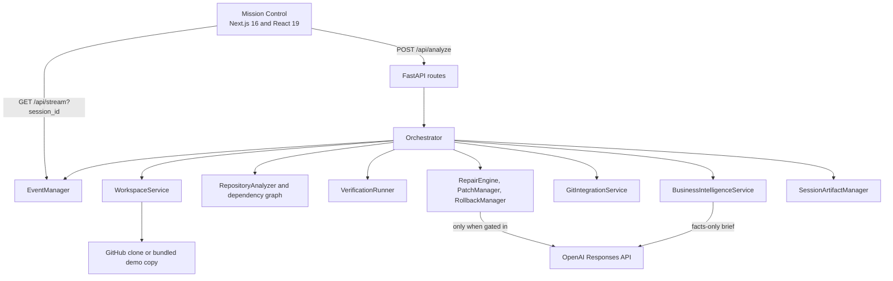

# Architecture

ForgeOS uses a small, stream-oriented architecture: a Next.js client starts one FastAPI orchestration run and derives its interface from a single Server-Sent Events stream.

## Responsibilities

| Area | Primary modules | Responsibility |
| --- | --- | --- |
| API | `backend/app/api/routes.py` | Starts runs and exposes the SSE stream. |
| Orchestration | `backend/app/pipeline/` | Owns the fourteen-stage sequence and the mutable `PipelineContext`. |
| Workspace | `backend/app/repository/workspace.py` | Creates a per-session clone or bundled demo copy. |
| Analysis | `backend/app/analysis/` | Inventories files, detects framework/test signals, and builds local import edges. |
| Verification | `backend/app/verification/pytest_runner.py` | Runs only discovered repository-owned test commands and classifies results truthfully. |
| Repair | `backend/app/services/ai_repair.py`, `repair_engine.py` | Generates bounded deterministic or structured model candidates. |
| Recovery | `patch_manager.py`, `rollback_manager.py` | Backs up changed files and restores failed repairs. |
| Intelligence | `business_intelligence.py`, `ai_insights.py` | Uses GitHub metadata first, then creates a facts-constrained brief. |
| Delivery | `frontend/hooks/`, `frontend/components/` | Reduces SSE events into the Mission Control experience. |

## Event Flow

1. `POST /api/analyze` allocates an eight-character session ID and schedules the run.
2. The pipeline publishes typed Pydantic events to the session event manager.
3. `GET /api/stream?session_id=...` replays buffered events, then yields live events.
4. The frontend `useEventStream` hook parses each message; `usePipelineState` reduces it into dashboard state.
5. A completed session remains replayable briefly, then is removed by the retention policy.

The event manager permits four active runs, retains up to 32 completed session buffers, and expires completed sessions after 15 minutes. This is a local-demo protection, not a distributed queue.

## Personas and Execution

Atlas, Forge, Pulse, Sentinel, Nitro, and Oracle are UI personas. They make the live run easy to scan; they are not independent backend agents. The actual backend is one orchestration pipeline.

- Atlas coordinates workspace and finalization stages.
- Oracle covers repository analysis, planning, and business intelligence.
- Forge covers deterministic and AI repair.
- Pulse covers verification and regression proof.
- Sentinel and Nitro publish health and performance-related signals.

OpenAI activity is separately streamed with a capability, owning persona, safe request ID metadata, and token counts when available.

## Data Boundaries

- Original repositories are not edited in place; modifications happen in `backend/app/workspaces/<session>/<repository>`.
- The model receives only bounded evidence: selected failure records, relevant source/test context, or collected business facts.
- Run artifacts are written below `backend/app/runs/run-<date>-<session>/`.
- Frontend state is ephemeral browser state reconstructed from SSE; run artifacts are the durable local record.
