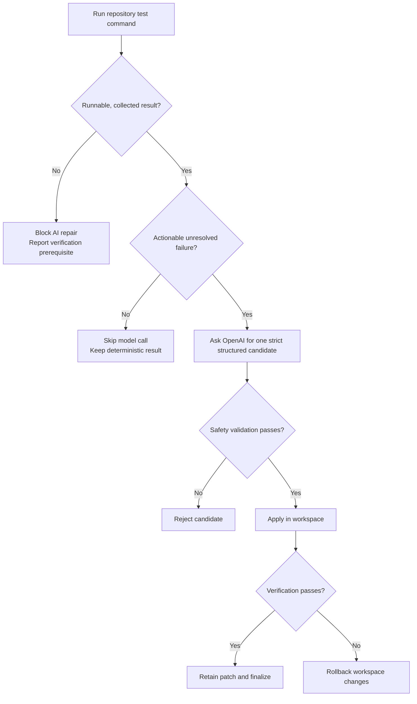

# Pipeline and Repair Gates

ForgeOS executes one ordered pipeline. Each stage emits pipeline, terminal, agent, and when relevant reasoning or decision events so the dashboard records what happened and why.

| # | Stage | Primary output |
| --- | --- | --- |
| 1 | Clone Repository | Isolated workspace and source identity. |
| 2 | Analyze Repository | File inventory, language, modules, import graph, entry points. |
| 3 | Detect Framework and Tests | Framework, test paths, command, and working directory. |
| 4 | Run Tests | Real command output, counts, failures, and execution status. |
| 5 | Classify Failures | Repair tasks and observed failure evidence. |
| 6 | Deterministic Fixes | Bounded repair candidates for known patterns. |
| 7 | AI Repair | One structured model repair only when the gate permits it. |
| 8 | Apply Patch | Workspace-only patch application and diff events. |
| 9 | Re-run Tests | Verification result and rollback decision. |
| 10 | Mutation Check | Eligibility/result signal; never claims unavailable checks passed. |
| 11 | Regression Test | One bounded model-generated candidate when eligible. |
| 12 | Calculate Health | Seven health dimensions and recommendations. |
| 13 | Business Intelligence | GitHub-first metrics and optional AI brief. |
| 14 | Stream Final Results | Final event, artifacts, and gated git finalization. |

## Repair Decision Tree

## When OpenAI Is Called

| Capability | Persona | Required conditions | Input boundary |
| --- | --- | --- | --- |
| Repair | Forge | A runnable test command collected an actionable failure not covered by deterministic candidates. | Failure evidence plus selected source and failing-test content. |
| Regression proof | Pulse | A repair was verified and the run began with repairable failures. | Repairable failures, selected source context, and valid test paths. |
| Business brief | Oracle | `OPENAI_API_KEY` is configured. | GitHub metrics and deterministic engineering signals. |

A configured key does not mean every run uses the model. A run with no runnable tests, no failures, or fully covered deterministic candidates must emit a blocked or skipped activity instead of pretending a call occurred.

## Test Status Meanings

| Status | Meaning |
| --- | --- |
| `passed` | A real repository test command ran with at least one passing test and no failures. |
| `failed` | The command ran and reported one or more test failures. |
| `no_tests` | No runnable automated test target was discovered. |
| `error` | Collection, environment, command, or dependency failure prevented a valid result. |

`no_tests` and `error` hold the repair gate closed. They are engineering findings, not successful verification.

## Health and Business Outputs

Health includes testing, security, architecture, performance, documentation, maintainability, and deployment readiness. The score is a repository signal, not a production certification.

Business intelligence uses GitHub metadata where available, falls back to repository-derived signals where necessary, and labels its source. The AI brief must remain within supplied facts and explicitly preserve uncertainty.
