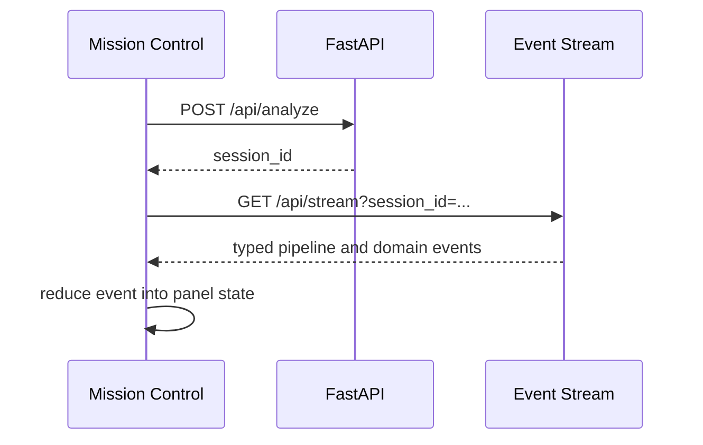

# ForgeOS Frontend

ForgeOS Mission Control is a Next.js 16 and React 19 dashboard for following a repository engineering run as it happens. It is not a second orchestration layer: the frontend renders the backend's typed REST response and SSE event stream.

## Runtime

- Next.js 16.2.10
- React 19.2.4
- TypeScript
- Tailwind CSS and the existing component primitives

```bash
cd frontend
npm ci
npm run dev
```

The app opens at `http://localhost:3000` and connects to `http://localhost:8000` by default. Set `NEXT_PUBLIC_API_URL` in `frontend/.env.local` when the backend is elsewhere.

## Source Map

| Location | Responsibility |
| --- | --- |
| `frontend/app/` | App Router entry route, shell, global styles |
| `frontend/components/` | Mission Control panels and shared visual elements |
| `frontend/hooks/useEventStream.ts` | SSE connection and event delivery |
| `frontend/hooks/usePipelineState.ts` | Reducer that derives dashboard state from events |
| `frontend/services/api.ts` | REST request for starting an analysis |
| `frontend/types/` | Typed API, SSE, and local state contracts |

## Mission Control

The dashboard combines repository intelligence, the live fourteen-stage timeline, terminal output, repair planning, diff review, repository tree, import graph, health, business intelligence, decision log, and the separate reasoning trace. Six personas make pipeline ownership legible: Atlas, Forge, Pulse, Sentinel, Nitro, and Oracle.

Agent status is driven by the backend. When an OpenAI request actually occurs, its activity event identifies the owning persona and can include the response request ID and token totals. A normal run may not call OpenAI because the repair gate requires a test-backed unresolved failure.

## Event Flow



See [Architecture](docs/architecture.md), [API and SSE Contract](docs/api.md), and [Development](docs/development.md) for the complete interface and validation workflow.
