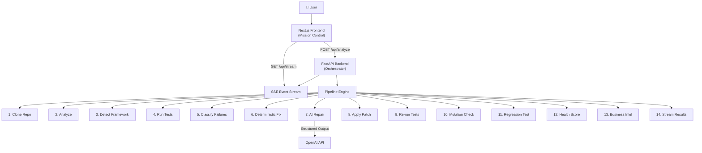

# ForgeOS — Implementation Plan

## Overview

ForgeOS is an Autonomous Software Engineering Operating System — a single orchestration pipeline that analyzes a repository, runs tests, repairs failures (deterministically or with AI), verifies results, and streams every step to a Mission Control dashboard via SSE.

**Current State:** Greenfield — only the spec and `.git` exist.

**Target Stack:**
- **Frontend:** Next.js 15 (App Router), TypeScript, TailwindCSS, shadcn/ui
- **Backend:** FastAPI, Python 3.12, Pydantic, OpenAI API
- **Communication:** Server-Sent Events (SSE)

---

## User Review Required

> [!IMPORTANT]
> This is a large project. I propose building it in **5 phases**, each producing a working increment. Please review the phasing and confirm before I begin implementation.

> [!IMPORTANT]
> **Demo Repository:** The spec requires a bundled demo repo with known issues (Python + FastAPI + pytest). I'll create this as `backend/demo_repository/` with intentional bugs for the pipeline to find and fix.

> [!IMPORTANT]
> **AI Provider:** The spec says "latest OpenAI coding-capable model." I'll use the OpenAI `responses` API with structured outputs. You'll need an `OPENAI_API_KEY` environment variable. Confirm this is acceptable or if you'd prefer a different provider.

---

## Open Questions

1. **Port configuration:** I'll default to `backend: 8000`, `frontend: 3000`. OK?
2. **Package manager:** `pnpm` for frontend, `uv` for backend? Or do you prefer `npm`/`pip`?
3. **shadcn/ui theme:** The spec says "bold editorial, thick black borders, offset shadows, bright accents, white cards." I'll build a custom neo-brutalist theme. Confirm?

---

## Proposed Phases

### Phase 1 — Foundation & Skeleton (This Session)
Get both apps running with the SSE bridge and a basic Mission Control layout.

### Phase 2 — Backend Pipeline (Core Engine)
The 14-step orchestration pipeline with real subprocess execution.

### Phase 3 — Frontend Panels (Full Dashboard)
All Mission Control panels wired to the SSE stream.

### Phase 4 — AI Repair & Verification
OpenAI integration, diff generation, patch application, re-verification.

### Phase 5 — Business Intelligence & Polish
GitHub API enrichment, health scoring, animations, demo optimization.

---

## Phase 1 — Detailed Plan

### Backend

#### [NEW] [pyproject.toml](file:///Users/yashdaga/Desktop/dev/ForgeOs/backend/pyproject.toml)
- Python 3.12 project config with dependencies: `fastapi`, `uvicorn`, `pydantic`, `openai`, `httpx`, `gitpython`

#### [NEW] [main.py](file:///Users/yashdaga/Desktop/dev/ForgeOs/backend/app/main.py)
- FastAPI app with CORS, lifespan, two routes: `POST /api/analyze`, `GET /api/stream`

#### [NEW] [models/events.py](file:///Users/yashdaga/Desktop/dev/ForgeOs/backend/app/models/events.py)
- Pydantic models for all SSE event types: `repository_update`, `architecture_update`, `terminal_log`, `planner_update`, `agent_update`, `diff_update`, `metrics_update`, `completed`

#### [NEW] [models/schemas.py](file:///Users/yashdaga/Desktop/dev/ForgeOs/backend/app/models/schemas.py)
- Request/response schemas: `AnalyzeRequest`, `AnalyzeResponse`, `RepositoryHealth`, `AgentStatus`

#### [NEW] [events/manager.py](file:///Users/yashdaga/Desktop/dev/ForgeOs/backend/app/events/manager.py)
- SSE event manager: publish events to connected clients, manages async queues per session

#### [NEW] [api/routes.py](file:///Users/yashdaga/Desktop/dev/ForgeOs/backend/app/api/routes.py)
- Route handlers for `/api/analyze` and `/api/stream`

#### [NEW] [pipeline/orchestrator.py](file:///Users/yashdaga/Desktop/dev/ForgeOs/backend/app/pipeline/orchestrator.py)
- Skeleton orchestrator with the 14-step pipeline (initially with mock/placeholder steps that emit SSE events)

#### [NEW] [pipeline/state.py](file:///Users/yashdaga/Desktop/dev/ForgeOs/backend/app/pipeline/state.py)
- Pipeline state machine: `PipelineState` enum and `PipelineContext` dataclass

---

### Frontend

#### [NEW] [package.json](file:///Users/yashdaga/Desktop/dev/ForgeOs/frontend/package.json)
- Next.js 15 project initialized with App Router, TypeScript, TailwindCSS

#### [NEW] [app/layout.tsx](file:///Users/yashdaga/Desktop/dev/ForgeOs/frontend/app/layout.tsx)
- Root layout with font loading (Inter/JetBrains Mono), metadata, global styles

#### [NEW] [app/page.tsx](file:///Users/yashdaga/Desktop/dev/ForgeOs/frontend/app/page.tsx)
- Main page rendering the MissionControl component

#### [NEW] [app/globals.css](file:///Users/yashdaga/Desktop/dev/ForgeOs/frontend/app/globals.css)
- TailwindCSS base + neo-brutalist design tokens (thick borders, offset shadows, accent palette)

#### [NEW] [types/events.ts](file:///Users/yashdaga/Desktop/dev/ForgeOs/frontend/types/events.ts)
- TypeScript types mirroring backend event models

#### [NEW] [types/pipeline.ts](file:///Users/yashdaga/Desktop/dev/ForgeOs/frontend/types/pipeline.ts)
- Types for agents, pipeline state, repository data

#### [NEW] [hooks/useEventStream.ts](file:///Users/yashdaga/Desktop/dev/ForgeOs/frontend/hooks/useEventStream.ts)
- Custom hook: connects to `GET /api/stream`, parses SSE, dispatches to state

#### [NEW] [hooks/usePipelineState.ts](file:///Users/yashdaga/Desktop/dev/ForgeOs/frontend/hooks/usePipelineState.ts)
- Central state management hook driven entirely by SSE events

#### [NEW] [services/api.ts](file:///Users/yashdaga/Desktop/dev/ForgeOs/frontend/services/api.ts)
- API client: `analyzeRepository(url: string)` → `POST /api/analyze`

#### [NEW] [components/MissionControl/MissionControl.tsx](file:///Users/yashdaga/Desktop/dev/ForgeOs/frontend/components/MissionControl/MissionControl.tsx)
- Main dashboard grid layout with all panel slots

#### [NEW] [components/RepositoryInput/RepositoryInput.tsx](file:///Users/yashdaga/Desktop/dev/ForgeOs/frontend/components/RepositoryInput/RepositoryInput.tsx)
- URL input + "Launch Analysis" button with loading state

#### [NEW] [components/AgentCards/AgentCard.tsx](file:///Users/yashdaga/Desktop/dev/ForgeOs/frontend/components/AgentCards/AgentCard.tsx)
- Individual agent card: mascot, status, progress bar, confidence, speech bubble

#### [NEW] [components/AgentCards/AgentPanel.tsx](file:///Users/yashdaga/Desktop/dev/ForgeOs/frontend/components/AgentCards/AgentPanel.tsx)
- Grid of all 8 agent cards

#### [NEW] [components/Timeline/Timeline.tsx](file:///Users/yashdaga/Desktop/dev/ForgeOs/frontend/components/Timeline/Timeline.tsx)
- Vertical timeline showing pipeline events with timestamps

#### [NEW] [components/LiveTerminal/LiveTerminal.tsx](file:///Users/yashdaga/Desktop/dev/ForgeOs/frontend/components/LiveTerminal/LiveTerminal.tsx)
- Terminal-style panel displaying real subprocess output + supervisor messages

#### [NEW] [components/DiffViewer/DiffViewer.tsx](file:///Users/yashdaga/Desktop/dev/ForgeOs/frontend/components/DiffViewer/DiffViewer.tsx)
- Unified diff viewer with syntax highlighting

#### [NEW] [components/HealthDashboard/HealthDashboard.tsx](file:///Users/yashdaga/Desktop/dev/ForgeOs/frontend/components/HealthDashboard/HealthDashboard.tsx)
- Radar/bar chart showing health dimensions + overall score

#### [NEW] [components/BusinessDashboard/BusinessDashboard.tsx](file:///Users/yashdaga/Desktop/dev/ForgeOs/frontend/components/BusinessDashboard/BusinessDashboard.tsx)
- Business intelligence panel: stars, forks, community metrics

#### [NEW] [components/RepositoryGraph/RepositoryGraph.tsx](file:///Users/yashdaga/Desktop/dev/ForgeOs/frontend/components/RepositoryGraph/RepositoryGraph.tsx)
- Visual dependency graph / architecture overview

#### [NEW] [components/RepositoryTree/RepositoryTree.tsx](file:///Users/yashdaga/Desktop/dev/ForgeOs/frontend/components/RepositoryTree/RepositoryTree.tsx)
- File tree browser for the analyzed repository

---

### Demo Repository

#### [NEW] [demo_repository/](file:///Users/yashdaga/Desktop/dev/ForgeOs/backend/demo_repository/)
- A minimal Python + FastAPI + pytest project with **intentional bugs**:
  - A failing test (assertion error)
  - A missing import
  - An unhandled edge case
- This gives the pipeline real failures to detect, fix, and verify

---

## Verification Plan

### Automated Tests
```bash
# Backend
cd backend && python -m pytest tests/ -v

# Frontend
cd frontend && npm run build  # Type-check + build verification
```

### Manual Verification
1. Start backend: `cd backend && uvicorn app.main:app --reload`
2. Start frontend: `cd frontend && npm run dev`
3. Enter the demo repo URL → pipeline starts → SSE events flow → dashboard populates
4. Confirm all panels render and update in real-time

---

## Architecture Diagram


